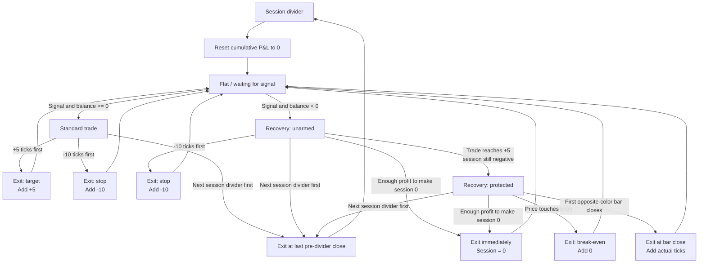

# Range Bar Pin Bar Strategy

## Purpose

This document defines the current intended behavior of the range-bar pin-bar strategy. It covers:

- How Buy and Sell entries are identified and entered
- How individual trades are evaluated
- How session profit and loss is accumulated
- How recovery mode changes the exit logic when the session is negative
- How entries, exits, results, and cumulative ticks should be displayed

This is the strategy specification. Older generated campaign reports may describe experimental rules such as 7-tick stops or different recovery exits; those rules do not override this document.

## Chart and Price Definitions

The initial implementation targets the MES 5-tick range chart.

- MES tick size: `0.25` points
- One complete range bar: `5 ticks` or `1.25 points`
- Entry price: the close of the annotated signal bar
- Favorable direction:
  - Buy: price moving upward
  - Sell: price moving downward
- Adverse direction:
  - Buy: price moving downward
  - Sell: price moving upward

All thresholds are measured from the entry bar's close. Evaluation begins after the entry bar because the trade is not entered until that bar closes.

## Pin-Bar Entry Concept

A candidate signal is a range bar that rejects price in the direction opposite the prevailing trend and closes back with the trend.

### Buy Candidate

A Buy candidate generally has:

- A rising EMA and bullish trend context
- A long lower tail showing rejection of lower prices
- A body at or above the EMA
- Limited overlap with the preceding bar's body
- A lower tail that reaches or nearly reaches the preceding body
- A blue/up close

### Sell Candidate

A Sell candidate is the directional inverse:

- A falling EMA and bearish trend context
- A long upper tail showing rejection of higher prices
- A body at or below the EMA
- Limited overlap with the preceding bar's body
- An upper tail that reaches or nearly reaches the preceding body
- A red/down close; a doji may be accepted by the projection logic

The chart can suggest these candidates, but a manually saved Buy or Sell annotation represents the actual strategy entry.

## Session Accounting

The black vertical divider marks the start of a new session.

- Each session begins with cumulative P&L of `0 ticks`.
- Completed trade results are added sequentially to that session's cumulative P&L.
- A negative balance never carries across a session divider.
- If a trade is still open at the next divider, close it at the final pre-divider bar's close, record the reason as `session-end`, add its actual result to the old session, and then reset the new session to zero.
- Only one trade may be active at a time. A signal annotated while an earlier trade is still open is marked `overlap-ignored` and does not affect P&L.

The strategy does not maintain a separate long balance and short balance. Buy and Sell results contribute to the same session total.

## Standard Mode

A trade uses standard mode when the session cumulative P&L is zero or positive immediately before entry.

### Standard Buy

- Profit target: `entry + 5 ticks`
- Stop: `entry - 10 ticks`
- Whichever threshold is reached first determines the result.

### Standard Sell

- Profit target: `entry - 5 ticks`
- Stop: `entry + 10 ticks`
- Whichever threshold is reached first determines the result.

### Standard Accounting

- Target exit: add `+5 ticks`
- Stop exit: add `-10 ticks`

## Recovery Mode

A trade enters recovery mode when the session cumulative P&L is negative immediately before entry.

Recovery mode has two phases: unarmed and protected.

### Phase 1: Recovery Unarmed

From entry, monitor three levels:

1. Hard stop: `10 ticks` adverse from entry
2. Recovery target: the favorable movement needed to bring session P&L exactly to `0`
3. Protection trigger: `5 ticks` favorable from entry

The first applicable event controls the transition:

- If the hard stop is reached first, exit immediately for `-10 ticks`.
- If the recovery target is reached first, exit immediately at that price. The session is now flat at `0`.
- If the trade reaches `+5 ticks` without yet restoring the session to zero, arm recovery protection.

Example: if the session begins a recovery trade at `-5`, a `+5` favorable move reaches the recovery target and exits immediately. There is no need to wait for another bar or arm a later exit.

### Phase 2: Recovery Protected

After the trade has reached at least `+5 ticks`, it must never become a losing trade. Exit on the first of these events:

1. **Recovery to zero:** Price reaches the favorable level required to bring session cumulative P&L to exactly `0`. Exit immediately at that price.
2. **Break-even floor:** Price returns to the trade's entry price. Exit immediately for `0 ticks` on the trade.
3. **Opposite-color close:** A completed bar closes in the direction opposite the trade. Exit at that bar's actual close and calculate the trade result from that close.

Opposite-color definitions:

- Buy recovery trade: the first completed red/down bar where `close < open`
- Sell recovery trade: the first completed blue/up bar where `close > open`

The opposite-color exit does not wait for price to return to entry. If a Buy reaches at least `+5`, then the first red bar closes while the trade is still `+3`, the trade exits for `+3 ticks`. The remaining session deficit is carried into the next eligible trade within the same session.

The break-even floor remains active at the same time. If price touches entry before the opposite-color bar closes, the trade exits at break-even instead. Consequently, a recovery trade that has armed protection cannot later produce a negative result unless the data contains an unresolved gap or ordering ambiguity.

## Recovery Examples

### Starting at -5 Ticks

- A Buy reaches `+5 ticks`.
- That movement restores the session from `-5` to `0`.
- Exit immediately at the recovery target.

### Starting at -10 Ticks and Fully Recovering

- A Sell reaches `+5 ticks`; protection becomes armed.
- It continues to `+10 ticks` before a blue bar closes or price returns to entry.
- Exit immediately at `+10`; session cumulative P&L becomes `0`.

### Starting at -10 Ticks and Exiting on Color Change

- A Buy reaches `+5 ticks`; protection becomes armed.
- The next red bar closes with the trade still `+3 ticks`.
- Exit at that close for `+3`; session cumulative P&L becomes `-7`.

### Starting at -10 Ticks and Returning to Entry

- A Sell reaches `+5 ticks`; protection becomes armed.
- Price reverses and touches the entry before a qualifying blue-bar close.
- Exit at entry for `0`; session cumulative P&L remains `-10`.

## State Machine

## Event Priority and OHLC Ambiguity

The strategy uses the first event that occurs in actual price order. Range-bar OHLC data does not always reveal that order.

Examples of ambiguity include:

- A standard trade's target and stop both appearing inside one bar
- A recovery bar reaching the `+5` protection level and the adverse level inside the same bar
- A protected recovery bar touching both the recovery target and entry

When ordering cannot be established reliably:

- Record the exit reason as `ambiguous`.
- Do not invent a favorable or adverse result.
- Do not alter cumulative P&L for that signal.
- Show an ambiguity marker so the result can be reviewed manually.

Lower-timeframe or tick data should be used later if exact intrabar sequencing becomes necessary.

## Chart Display and Exit Reasons

### Entry Markers

- Green arrow: successful trade
- Red arrow: stopped or losing trade
- Neutral dark arrow: break-even trade
- Orange marker: ambiguous outcome
- Gray marker or `IGN`: overlapping signal ignored while another trade is open
- Pending marker: the outcome is not yet known

### Cumulative Tick Labels

Each accepted entry shows the session cumulative tick total after that trade resolves.

- Positive totals include a leading plus sign, such as `+5` or `+10`.
- Negative totals include a minus sign.
- Totals restart at zero after every black session divider.
- Label color must contrast with the associated arrow:
  - White text on black or other dark arrows
  - Black text on light arrows
  - A small contrasting outline or halo when needed against the gray chart

### Exit Markers

Intrabar exits should use a small sideways arrow at the exit bar and exit price. Close-based exits should be anchored to the bar's close.

Suggested reason codes:

| Code | Exit reason | Price used |
|---|---|---|
| `TGT` | Standard +5 target | Exact target price |
| `STOP` | Standard or recovery -10 stop | Exact stop price |
| `R0` | Recovery brings session to zero | Exact recovery price |
| `BE` | Protected recovery returns to entry | Entry price |
| `OPP` | First opposite-color close after protection is armed | Opposite-color bar close |
| `END` | Session divider reached while trade remains open | Last pre-divider bar close |
| `AMB` | Intrabar event order cannot be determined | Review location |

## Evaluation Record

Every evaluated signal should retain enough information to explain its result:

- Session identifier and session starting balance
- Entry bar index, timestamp, direction, and entry price
- Whether the trade began in standard or recovery mode
- Whether and when recovery protection became armed
- Exit bar index, timestamp, and exit price
- Exit reason
- Trade P&L in ticks
- Session cumulative P&L after exit
- Whether the outcome was intrabar, close-based, ambiguous, pending, or ignored

This record is the audit trail behind the chart arrows and cumulative labels.
